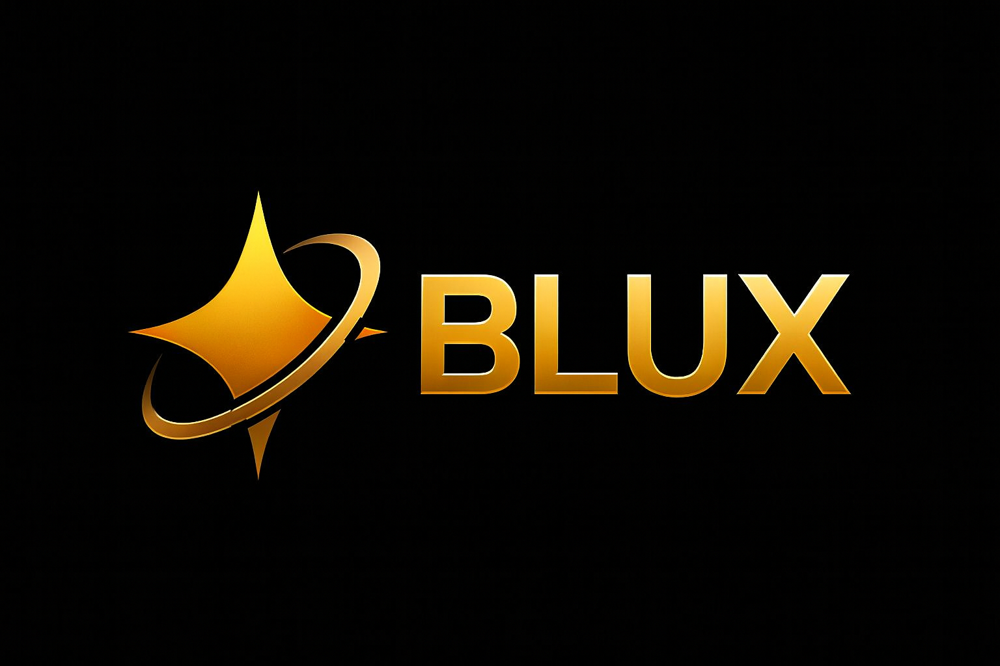

<p align="center">
  

</p>

<h1 align="center">BLUX Lite GOLD</h1>
</p>


---

<p align="center">
  
  
  
  
</p>

---


> BLUX Lite GOLD is a unified AI Hive-Mind Orchestrator for installing, managing, and running open‑source and corporate AI engines and models on Linux, macOS, Termux, and WSL2. With aim for skill-set routing, automatic AI fetching, and **plugins / scripts** *menu's / idea's* that take this software beyond it's initially boxed concept.

---

## Origin Story — Phone as Forge  

This project wasn’t built in a lab.  
It wasn’t built with millions.  
It wasn’t even built on a laptop.  

BLUX Lite GOLD was forged on a **phone**, inside **legacy Termux**, with nothing but raw tools — folder explorers, file viewers, and persistence.  

That’s the point: the Iron Suit built from scraps.  
Proof of what one man and an AI can do when they refuse to wait for perfect tools.  

(( • ))

---

## 📑 Table of Contents
- [✨ Highlights](#highlights)
- [✅ Platform Status](#platform-status)
- [🚀 Quickstart](#quickstart)
- [🧰 Commands & Menus](#commands--menus)
- [📂 Project Layout](#project-layout)
- [⚙️ Configuration](#configuration)
- [📦 Packaging](#packaging)
- [🔧 Maintenance](#maintenance)
- [🧪 Dev Tips](#dev-tips)
- [🤝 Contributing](#contributing)
- [⚖️ License](#license)
- [🙏 Acknowledgements](#acknowledgements)
- [🤝 AI Collaborators](#ai-collaborators)
- [👁️ Original Vision Statement](#original-vision-statement)
- [🌟 Release Philosophy](#release-philosophy)
- [✅ Release Status](#release-status)
- [Optional Cloud Integrations (Disabled by Default)](#optional-cloud-integrations-disabled-by-default)
- [Audit Results (v1.0.0)](#audit-results-v100)
- [🌌 Ashes to Code](#ashes-to-code)
- [Catalogs (Engines & Models)](#catalogs-engines--models)
- [Integrated Shell (CLI)](#integrated-shell-cli)
  - [Developer Console (Integrated Shell) — Pro workflow](#developer-console-integrated-shell--pro-workflow)
  - [Create plugins & scripts from your vision](#create-plugins--scripts-from-your-vision)
  - [Safety & uploads workspace](#safety--uploads-workspace)
  - [Command planner (explicit execution)](#command-planner-explicit-execution)
  - [User Scripts & Plugins menus (opt-in extras)](#user-scripts--plugins-menus-opt-in-extras)


---

## ✨ Highlights

- **Unified CLI | Shell Integration** to manage models, engines, and plugins / scripts directly within the BLUX Lite GOLD software w/o need to exit
- **Portable installs** across Linux, macOS, WSL2, and Termux/Android
- **Smart bootstrap** via `first_start.sh`, then single runner via `auto-start.sh`
- **Pluggable** architecture: add tools under `plugins/`
- **Project profiles** .libf is the Liberation Framework that gives user's full control over established project memory, saved via `libf/projects`
- **Batteries included:** helper scripts under `scripts/`
- **Rotating Footer Signals** embedded in Legacy/TUI menus (`(( • ))` word-signal rotation)

---

## ✅ Platform Status

| Platform           | Device/Notes | Status                         |
|--------------------|--------------|--------------------------------|
| **Termux / Android** | Pixel 6 Pro  | ✅ Tested & Approved            |
| **Linux (Distros)**  | —            | ⚠️ Testing / Debugging Needed   |
| **WSL2 / Windows**   | —            | ⚠️ Testing / Debugging Needed   |
| **macOS / Apple**    | —            | ⚠️ Testing / Debugging Needed   |

---

## 🚀 Quickstart

<details>
<summary>Click to Expand BLG Quickstart Notes</summary>

### 1) Clone
```bash
git clone https://github.com/Justadudeinspace/blux-lite.git
cd blux-lite
```

### 2) Install system deps + Python env
```bash
chmod +x first_start.sh
./first_start.sh
```

This creates `.venv/` and installs packages from `requirements.txt`:
- set permissions
- install/verify dependencies
- prepare config folders
- **generate `auto-start.sh`**

### 3) **After first run (normal use):**
```bash
./auto-start.sh
```
This activates `.venv` and launches `blux-lite.sh` (Legacy/TUI menu).

### Run the CLI
```bash
source .venv/bin/activate
python -m blux.cli --help
# or using entry points (when installed)
# blux    # alias to shiv.cli:main
# bluxpy  # alias to blux:cli
```

> Prefer `python -m blux.cli` during development; use `pip install -e .` for editable installs.

</details>

---

## 🧰 Commands & Menus

<details>
<summary>Click to Expand BLG Cmds & Menu's / Note's</summary>

- `blux.py` – high‑level runner
- `plugin_menu.sh` / `scripts_menu.sh` – TUI helpers
- `scripts/main_menu/` – bootstrap + ops tasks (install deps, secrets, catalog, etc.)

Common scripts:
```bash
scripts/update_all.sh        # update engines/models and docs
scripts/diagnostics.sh       # basic health checks
scripts/backup_blux.sh       # archive project data
scripts/rclone_setup.sh      # cloud sync helper
```

</details>

---

## 📂 Project Layout

<details>
<summary>Click to Expand BLG File Tree</summary>

```lsd
blux-lite/
├── blux/
│   ├── orchestrator/
│   │   ├── evaluator/
│   │   │   ├── __init__.py
│   │   │   ├── bash.py
│   │   │   └── python.py
│   │   ├── __init__.py
│   │   ├── classifier.py
│   │   ├── controller.py
│   │   ├── logs.py
│   │   ├── registry.py
│   │   └── router.py
│   ├── __init__.py
│   ├── ai_parse.py
│   ├── bluxq.py
│   ├── catalog_install.py
│   ├── cli.py
│   ├── config.py
│   ├── engines.py
│   ├── installer.py
│   ├── ish.py
│   ├── keywords.py
│   ├── legacy_menu.py
│   ├── libf_loader.py
│   ├── memory.py
│   ├── models.py
│   ├── plugins.py
│   ├── README.md
│   ├── router.py
│   ├── secrets.py
│   ├── settings.py
│   ├── tui_blg.py
│   ├── tui_blg.tcss
│   ├── utils.py
│   └── version.py
├── docs/
│   ├── assets/
│   │   ├── blux-lite-banner.png
│   │   └── blux-wiki-footer.svg
│   ├── COMMANDS.md
│   ├── ENGINES_MODELS.md
│   ├── LIBF_GUIDE.md
│   ├── QUICKSTART_HIGH_END.md
│   ├── QUICKSTART_LINUX.md
│   ├── QUICKSTART_LOW_RAM.md
│   ├── QUICKSTART_MACOS.md
│   ├── QUICKSTART_NORMAL.md
│   ├── QUICKSTART_WINDOWS.md
│   ├── STORAGE_GUIDE.md
│   └── README.md
├── engines/
│   ├── engines_catalog.json
│   └── README.md
├── examples/
│   └── cloud/
│       ├── README.md
│       ├── load_secrets.sh
│       └── rclone_setup.sh
├── heart/
│   ├── index.html
│   ├── app.js
│   └── style.css
├── libf/
│   ├── libf_public_framework.zip
│   ├── README.md
│   └── projects/
│       └── README.md
├── models/
│   ├── catalog_full.json
│   └── README.md
├── plugins/
│   ├── liberation_framework/
│   │   ├── libf_export.py
│   │   ├── libf_hub.py
│   │   ├── libf_note.py
│   │   ├── libf_save.py
│   │   └── project.py
│   ├── _template.py
│   ├── aik_mobile.py
│   ├── android_recipes.py
│   ├── android_sdk.py
│   ├── apk_retool.py
│   ├── apktool_plugin.py
│   ├── bench.py
│   ├── buildtools_signalign.py
│   ├── catalog.py
│   ├── code_quality.py
│   ├── community_fetcher.py
│   ├── compat_scan.py
│   ├── daisy_of_jadis.py
│   ├── doctor.py
│   ├── dtc_tools.py
│   ├── engines_plus.py
│   ├── genkit.py
│   ├── gguf_tools.py
│   ├── heimdall_tools.py
│   ├── lora_manager.py
│   ├── modpacks.py
│   ├── mtkclient_plugin.py
│   ├── payload_tools.py
│   ├── plug.py
│   ├── recipes.py
│   ├── rom_manager_safe.py
│   ├── router_debug.py
│   ├── savscrip.py
│   └── sys.py
├── scripts/
│   ├── cloud/
│   │   ├── admin.sh
│   │   ├── blux_cloud_safety_addon.sh
│   │   ├── heart.sh
│   │   ├── kill_switch.sh
│   │   ├── selftest.sh
│   │   └── snapshot.sh
│   ├── main_menu/
│   │   ├── aliases_install.sh
│   │   ├── auto_start_all.py
│   │   ├── auto_start_all.sh
│   │   ├── backup_blux.sh
│   │   ├── blux_autostart_boot.sh
│   │   ├── blux_box86_wine.sh
│   │   ├── blux_freshtermux.sh
│   │   ├── blux_proot_arch.sh
│   │   ├── blux_services_setup.sh
│   │   ├── blux_simple_tar_backup.sh
│   │   ├── blux_styling_apply.sh
│   │   ├── blux_widget_shortcut.sh
│   │   ├── catalog.sh
│   │   ├── diagnostics.sh
│   │   ├── disk_check.sh
│   │   ├── docs-cli.sh
│   │   ├── doctor.sh
│   │   ├── env.sh
│   │   ├── flashing_helper.sh
│   │   ├── fzf_env.sh
│   │   ├── install_blux_shiv.sh
│   │   ├── install_deps.sh
│   │   ├── load_secrets.sh
│   │   ├── logging.sh
│   │   ├── logs.sh
│   │   ├── logs_rotate.sh
│   │   ├── preinstall_hf.sh
│   │   ├── remove_engs_and_mods.sh
│   │   ├── restore_blux.sh
│   │   ├── run_shellcheck.sh
│   │   ├── runner_dry_run.sh
│   │   ├── setup_termux_api.sh
│   │   ├── starship_setup.sh
│   │   ├── termux_boot_enable_blux.sh
│   │   ├── update_all.sh
│   │   └── validate_secrets.sh
│   ├── tui/
│   │   ├── *.tui.sh (various TUI wrappers for main_menu + plugins)
│   ├── mod_tools/
│   │   ├── adb_helper.sh
│   │   ├── flashing_helper.sh
│   │   ├── install_power_tools.sh
│   │   └── setup_termux_api.sh
│   ├── user_menu/
│   │   ├── plugins_menu.sh
│   │   └── scripts_menu.sh
│   ├── ish.sh
│   └── README.md
├── shim/
│   └── launcher.py
├── tests/
│   └── manifest.json
├── .config/blux-lite-gold/auto-start.json
├── .gitignore
├── .env.example
├── CHANGELOG.md
├── CREDITS.md
├── INSTALL.md
├── LICENSE
├── MODELS.md
├── README.md
├── blux-lite.sh
├── blux_lite.sh
├── blux.py
├── first_start.sh
├── plugin_menu.sh
├── scripts_menu.sh
├── pyproject.toml
├── requirements.txt
└── start_litellm.sh
```

</details>

<details>
<summary>Click to Expand BLG File Tree Notes</summary>

Key paths:
- `blux/` – core Python package (CLI, orchestrator registry/router/controller, evaluators, TUI, config, memory, secrets, etc.)
- `plugins/` – extensible plugin library (Android tooling, catalog, code quality, doctor, liberation framework, etc.)
- `scripts/` – automation & platform helpers; submenus for `main_menu/`, `tui/`, `cloud/`, `mod_tools/`, and `user_menu/`
- `docs/` – quickstarts, guides, audit reports, reference tables
- `heart/` – lightweight webapp shell (`index.html`, `app.js`, `style.css`)
- `libf/` – Liberation Framework for project memory/history (`projects/`, export/save tools)
- `engines/` – engines catalog + metadata
- `models/` – models catalog + metadata
- `shim/` – lightweight launcher (`launcher.py`)
- `tests/` – manifests for validation
- `.config/blux-lite-gold/` – runtime configuration (`auto-start.json`, router/catalogs)
- `.secrets/` – **do not commit**; `.env` templates and examples
- Root scripts (`first_start.sh`, `auto-start.sh`, `blux-lite.sh`, `plugin_menu.sh`, `scripts_menu.sh`) – bootstrap, run chain, and entry menus

</details>

---

## ⚙️ Configuration

<details>
<summary>Click to Expand BLG Configuration Notes</summary>

- Copy `.secrets/secrets.example.env` → `.secrets/secrects.env` (fix paths/tokens)
- Adjust `.config/blux-lite-gold/config.yaml` and `router.yaml` as needed
- Catalog data lives in `models/catalog_full.json` & `engines/

> Keep secrets local; `.secrets/.gitignore` protects them from commits.

</details>

---

## 📦 Packaging

<details>
<summary>Click to Expand BLG Packaging Notes</summary>

`pyproject.toml` defines everything needed to build and distribute.

- Runtime python: **>= 3.9**
- Core deps pinned in `requirements.txt`, ranged in `pyproject.toml`
- Console scripts:
  - `blux = shiv.cli:main`
  - `bluxpy = blux:cli`

Build sdist/wheel:
```bash
python -m pip install --upgrade build
python -m build
```

Editable dev install:
```bash
python -m pip install -e .
```

</details>

---

## 🔧 Maintenance

<details>
<summary>Click to Expand BLG Maintenance Notes</summary>

- Update manifests:
  ```bash
  python scripts/main_menu/upgrade_manifests.py
  ```
  This refreshes `requirements.txt` pins and bumps `pyproject.toml` ranges.

- Re-run deps:
  ```bash
  first_start.sh
  ```

</details>

---

## 🧪 Dev Tips

<details>
<summary>Click to Expand BLG Dev Tips</summary>

- Run shellcheck over scripts:
  ```bash
  scripts/run_shellcheck.sh
  ```
- Termux helpers live under `scripts/` (boot, services, styling, widget shortcuts)
- Use `docs/QUICKSTART_*` guides for device‑specific setups

</details>

---

## 🤝 Contributing

<details>
<summary>Click to Learn How to Contribute</summary>

1. Fork & branch
2. Keep scripts cross‑platform (Termux + Linux + macOS)
3. Add docs under `docs/` when introducing new plugins/engines
4. Run diagnostics before PR

</details>

---


## ⚖️ License

<details>
<summary>Click to Expand all BLG Licensing Info</summary>

**License column legend for Model Catalog**
- **Open**: No account gate; standard open license.
- **Account-gated**: Free to use, but requires HF account acceptance.
- **EULA/Accept**: Vendor terms must be accepted before download (may include restrictions).

**BLUX Lite Project License**
- **BLUX Lite GOLD** is licensed under the **MIT License** (canonical; duplicate license variants removed).
- Each model & engine retains its **own license**.

</details>

---

## 🙏 Acknowledgements

BLUX Lite GOLD stands on the work of many upstream developers and organizations.  
This project is not affiliated with them, but we acknowledge their contributions.

👉 For the full curated list of every plugin, script, framework, engine, and model credited: see [CREDITS.md](./CREDITS.md).

To all maintainers, contributors, and community members of these ecosystems: thank you.  

---

## 🤝 AI Collaborators

This project has been built 100% independently — no human collaborators, only AI systems that helped shape, debug, and expand BLUX Lite GOLD into reality.

BLUX Lite GOLD is designed to work alongside multiple AI systems.  
Current collaborators include:

- **[Gemini-CLI](https://github.com/google-gemini/gemini-cli)**  
  Used for quick command-line interaction with Google’s Gemini models.  
  Helps test routing logic, validate orchestration, and expand task coverage.

- **[OpenAI GPT-4o](https://platform.openai.com/docs/models/gpt-4o)**  
  For fast reasoning + multi-modal tasks.

- **[OpenAI GPT-5](https://platform.openai.com/docs/models/gpt-5)**  
  For deeper reflection, debugging, and structured assistance.

- [ChatGPT (GPT-4o / GPT-5 / GPT 5 Codex)](https://openai.com/chatgpt)  
  *Co-Designer / Engineer / Guide* — aided in code structure, architectural decisions, overall vision, and patient guidance.

- [DeepSeek Coder v1.3.1(99)](https://deepseek.com/)  
  *Primary Error Checks / Debugging* — assisted with catching logical bugs, fixing edge cases, and refining scripts.

- [Perplexity AI](https://www.perplexity.ai/)  
  *Spot Checks* — used for quick validation, fact-checking, and secondary research support.

- [Firebase Genkit](https://firebase.google.com/genkit)  
  *Unintentional Vision Expansion* — influenced ideas and architectural inspiration during exploration.
  
- [Blackbox.ai](https://www.blackbox.ai/)
  *Unintentional / Original Spark of Inspiration* — intial AI used as inspiration sparked the fire, hince the evolution and creation of our ecosystem name. "BLUX" was originally conceptualized and formulted through envisioning a union between Blackbox.ai & Termux. The vision expanded beyond from there. 

---

**“AI Influence Driven Behind a Vision | Gratitude to My AI Companions”**  
~ JADIS

---

## 👁️ Original Vision Statement

<details>
<summary>Click to Expand BLG Vision Statement</summary>

**BLUX Lite GOLD is not a fork, clone, or derivative of existing orchestrators.**  
This project was born through my own independent experimentation with AI, long before I ever learned of other orchestration frameworks.  

The design — a *hive-mind orchestrator* with full spectrum access (Legacy menu or TUI), skill-set routing, and automatic AI fetching — grew from my vision of how multiple models could collaborate as one.  

Other orchestrators may exist, but **BLUX Lite GOLD stands on its own foundation**:  
- **Independent origin** — conceived and tested through personal trial and error  
- **Purpose-driven** — built for autonomy, transparency, and skill showcase  
- **Unique flow** — every feature ties back to the philosophy and architecture locked into this project  

This is an **original work**, carried forward with intent and ownership.

</details>

---

## 🌟 Release Philosophy

<details>
<summary>Click to Expand BLG Release Philosophy</summary>

BLUX Lite GOLD is more than just a software project — it’s a proof of concept, a personal milestone, and a statement of vision.  

This release marks the first **public milestone** of a system designed entirely on mobile hardware, engineered from the ground up without formal training, and guided by relentless curiosity. Every line of code was written, tested, and refined in the palm of a hand before ever stepping into Software Development 101.  

AI played a pivotal role not just as a tool, but as a **collaborator**. From co-designing architecture, to debugging complex flows, to expanding the project’s vision, multiple AI systems have influenced BLUX Lite GOLD’s shape. This project recognizes their contributions openly — because innovation doesn’t exist in isolation, and integrity demands acknowledgment.  

This release is **public** to share the groundwork, inspire experimentation, and open the door for greater projects to come. The journey continues — BLUX Lite GOLD is only the beginning.

</details>

---

> BLUX Lite GOLD: streamline engine + model orchestration, built for easy deployment across platforms.


---

## ✅ Release Status

<details>
<summary>Click to Expand BLG Release Status</summary>

This build of **BLUX Lite GOLD v1.0.0** is published.

### What this means
- ✅ Core run chain works (`first_start.sh → blux-lite.sh`)  
- ✅ Orchestrator modules and menus load without fatal errors  
- ✅ Automated scans (Python + shell) pass syntax and lint checks  
- ⚠️ **TUI (Textual UI) is incomplete** — navigation is minimal, errors may occur when moving between menus  
- ⚠️ Cross-platform testing still incomplete (macOS, WSL2, Linux variants)  
- ⚠️ Expect bugs, rough edges, and missing polish — this is an *early learning build*  

### Scope of validation
- Python modules: **syntax checks + imports**  
- Shell scripts: **hardened flags + static scan**  
- TUI wrappers: **smoke tested only**  

### Next steps
- Expand orchestrator with real model integration  
- Harden cross-platform support  
- Fill out TUI navigation + improve UI design  
- Document reproducible installation & upgrade flow  

👉 This release is **open for feedback and community testing**. Please file issues for bugs, gaps, or improvements.

</details>

---


## Optional Cloud Integrations (Disabled by Default)
Cloud helpers and personal secret loaders have been moved to `examples/cloud/`. 
They are **off by default** for public releases. To enable, copy the relevant example, create a local `.env` with your own keys, and set `BLG_ENABLE_CLOUD=1`. Never commit secrets.

---

<p align="center">
  
</p>


---


## Audit Results (v1.0.0)

<details>
<summary>Click to Expand BLG v1.0.0 Audit Results</summary>

- **Bash scripts:** pass (91/91)  
- **Python modules:** pass (25/25)  
- **TUI wrappers:** pass (49/49) — but **functional coverage is minimal**; UI is incomplete and navigation errors are expected  
- **Confidence rating:** 75%  
- **25% reserved for cross-platform testing / debugging** (macOS variations, WSL2, Linux distros, shells, etc.)
- **Strict-mode enforced** across all shell scripts (`set -euo pipefail` + exec bits)
- **Config paths normalized** under `.config/blux-lite-gold/`


</details>

---


## 🌌 Ashes to Code

**Ashes to Code (ATC)** is the raw, unfiltered journal behind the making of BLUX Lite GOLD.  
It documents the struggle, resilience, and vision that forged this project from nothing.  

> Built not in comfort, but in fire.  
> Pushed forward through uncertainty, doubt, and hardship.  
> Every line of code is backed by lived experience and the refusal to quit.  

Ashes to Code is where BLUX shows its heart.  
If BLUX Lite GOLD is the product — **Ashes to Code is the story.**

- Follow the journey here → [Ashes to Code](https://github.com/Justadudeinspace/ashes-to-code)

(( • ))

---

## Catalogs (Engines & Models)

BLUX Lite GOLD ships with automatically generated catalogs under `.config/blux-lite-gold/catalogs/`:

- `engines.json` — local/server runtimes (Ollama, llama.cpp, vLLM, TGI, TensorRT-LLM).
- `models.json` — curated OSS + hosted models (Llama 3.1, Mixtral, Qwen2.5, StarCoder2, DeepSeek-R1; plus API: GPT‑4o, Claude Sonnet 4, Gemini 2.5, Grok, Perplexity Sonar, Gemma).

### CLI usage

```bash
python -m blux.catalog_install engines
python -m blux.catalog_install models
python -m blux.catalog_install plan llama-3.1-8b   # emits a concrete install plan
```

> Hosted APIs include official docs links; open-weight entries include Hugging Face pages and Ollama tags when available.


### Provenance & freshness

These catalogs are **curated from official docs**. Each entry includes a `citations` array that maps to our internal web references. For the latest specs/pricing/terms, always check the provider docs linked in each item.


> Catalog scope: **models.json** now includes text/code generators, **embeddings**, **ASR**, and **VLMs** in one file (use the `task` field). **engines.json** lists local, server runtimes, hosted APIs, and meta-routers.


## Integrated Shell (CLI)

Launch an in-app shell to avoid exiting BLUX:

```bash
# from Legacy menu:
./scripts/ish.sh

# via CLI:
python -m blux.ish        # interactive
python -m blux.ish "ls -la"  # non-interactive
python -m blux.cli shell  # Typer command
```

Shell commands:
- `:help` — list BLUX commands
- `:ai <prompt>` — route to AI (stub for now; will connect to orchestrator)
- `:catalog` / `:plan <id>` / `:apply <id>` — model catalogs
- `:doctor`, `:logs`
- `:cd <path>`, `:py`, `:exit`


### Developer Console (Integrated Shell) — Pro workflow

Commands:
- `:model / :model set <id>` — pick active model for `:ai`
- `:ai <prompt>` — talks to the local-first orchestrator (Ollama if tagged/available)
- `:ls [path]`, `:open <path>`, `:new <path>` — quick filesystem tools (end input with `EOF`)
- `:git status`, `:git diff [path]` — version control helpers
- `:project`, `:project set <name>` — set working project name
- `:env`, `:tail`, `:doctor`, `:py`, `:cd`, `:exit`

Routing:
- If the active model has an **Ollama tag** and Ollama is installed, `:ai` executes via `ollama run`.
- API-only models print guidance so you can call providers securely from your environment.


### Create plugins & scripts from your vision

```bash
:plugin new my_tool "My Tool"
:script new scripts/my_tool.sh "My Tool Script"
:tools show
:tools apply
```

When `:ai` returns code blocks with a `path=...` (e.g., ```python path=blux/new.py```), BLUX automatically **queues a plan** to write those files. You stay in full control by reviewing with `:tools show` then committing with `:tools apply`.


### Safety & uploads workspace

- **Safe write paths** (enforced): `uploads/`, `scripts/`, `plugins/liberation_framework/`, `.config/blux-lite-gold/`, `docs/`  
  Attempts to write elsewhere are **denied** with `DENY: unsafe path`.
- **uploads/**: place files/zips here for AI to scan or use. Inside the shell:
  - `:uploads ls` — list files under uploads
  - `:uploads open <path>` — print a file (must be under uploads)
  - `:uploads unzip <zip>` — extract a zip (must live in uploads/)

### Command planner (explicit execution)
- `:cmd plan "<shell command>"` → queue a command
- `:cmd show` → review
- `:cmd apply` → execute queued commands (then they’re removed)


### User Scripts & Plugins menus (opt-in extras)

- **TUI**: `User Scripts`, `User Plugins` entries show only your items — system scripts (`scripts/main_menu/*`, `scripts/tui/*`, `scripts/lib/*`, `first_start.sh`, `blux-lite.sh`, `scripts_menu.sh`, `auto-start.sh`, `ish.sh`) and core .libf plugins are hidden.
- **Legacy**: mirrored entries with the same behavior.
- Plugins list uses **filename as slug** — runs via `python -m blux.cli <slug> [args]`.
